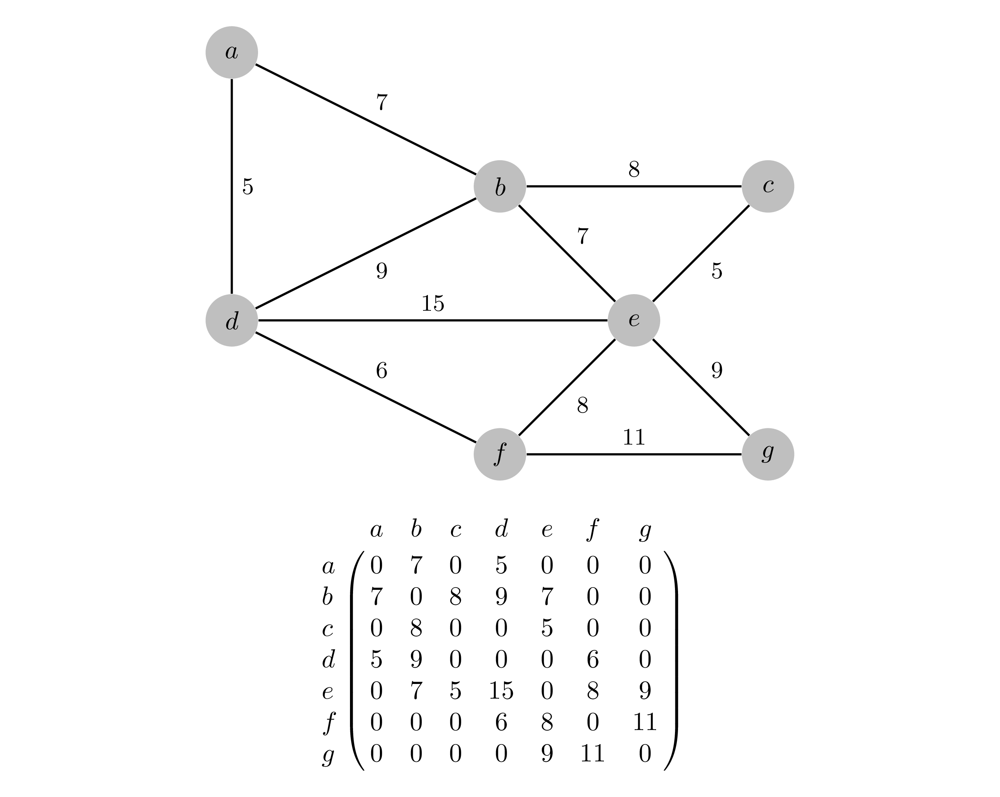
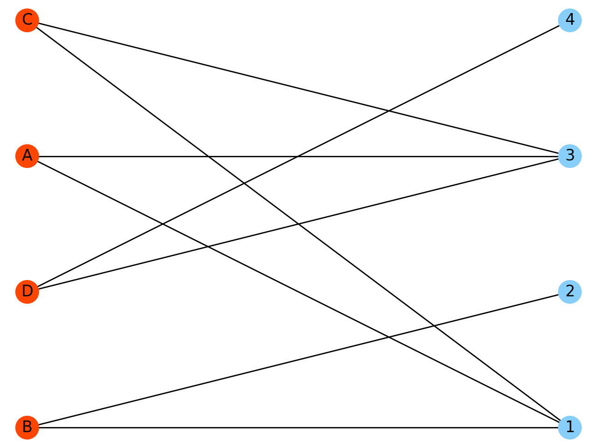
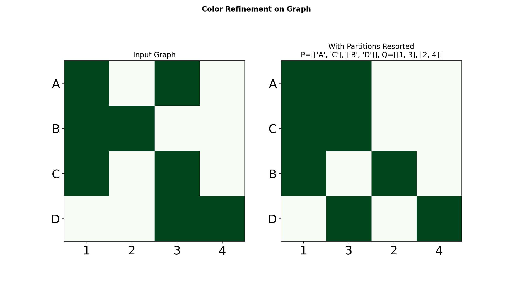
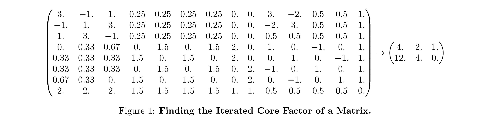
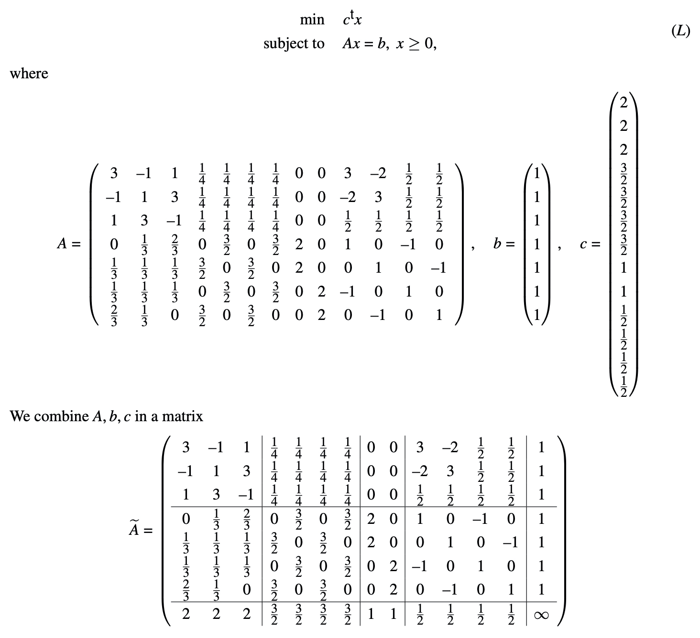
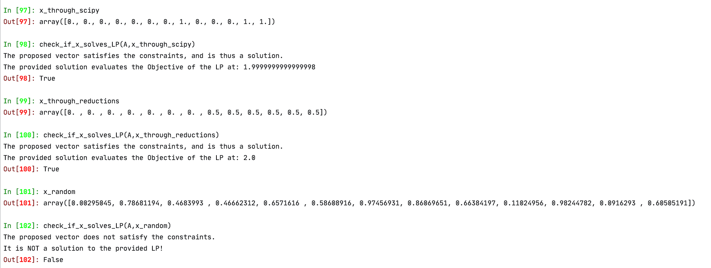
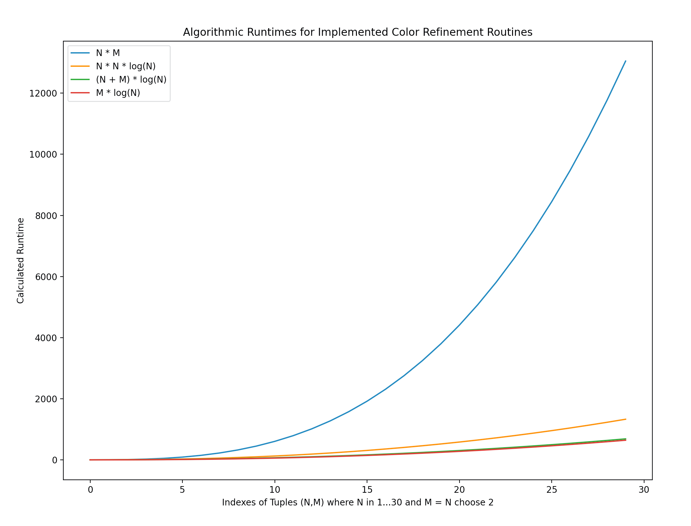
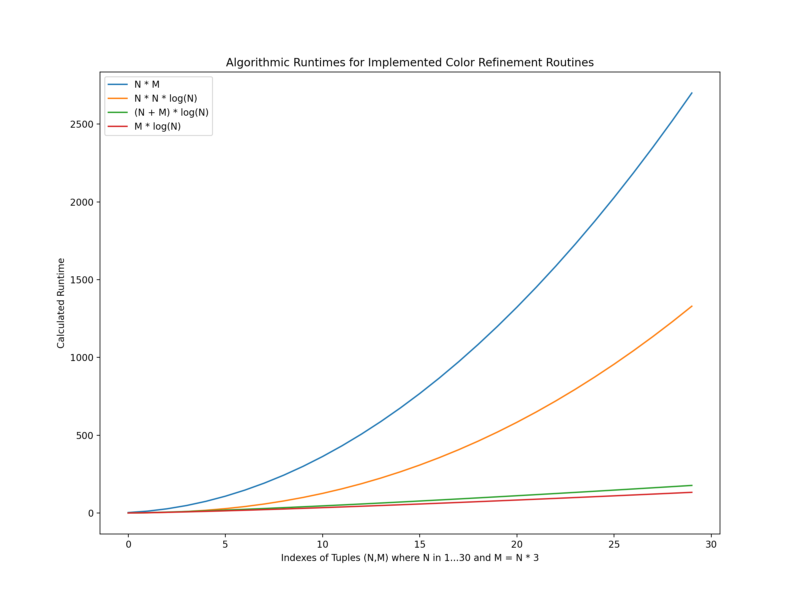

## Dimension Reduction via Color Refinement

Based on [Grohe et al. "Dimension Reduction via Color Refinement"](https://arxiv.org/pdf/1307.5697.pdf). 

A graph can be viewed as a matrix and vice versa:


Given for instance following matrix, and running the subsequent function,

```python
A = np.array([
    [1, 0, 1, 0],
    [1, 1, 0, 0],
    [1, 0, 1, 0],
    [0, 0, 1, 1],
])
d = show_graph_and_partitions(A)
```

generates the corresponding bipartite graph:


The following plots show the Original Graph as a Matrix (color means there exists an edge for the given pair), and on the right is the *permutated* Matrix according to the partitions calculated by Color Refinement (also known as 1-dimensional Weisfeiler-Lehman):



Color Refinement finds the coarsest stable coloring. The plots show a kind of symmetry information.

The equitable partitions also allow for calculating the iterated core factor of a possibly big matrix:



Simply run

```python
A_itr_core, _ = calculate_iterated_core_factor(A) 
```

This procedure can be used for the dimensionality reduction of Linear Programs (LPs) formulated in matrix form. Any LP with only equality constraints can be formulated as a matrix, e.g.:


The iterated core factor computed in the previous example corresponds to the two-times reduction of the matrix from LP *L* in the above example. A solution to the corresponding LP of the small matrix is also a solution of the LP i.e., it satisfies the constraints and tries to optimize the objective. Here is a comparison of three vectors* and how they relate to the original LP: 

(*) `x_through_scipy` is a solution which stems from direct application on the original LP, `x_through_reductions` is a solution which stems from the reconstruction of a solution to the reduced LP, `x_random` is just a random vector that does not solve the LP

The above comparison has been performed running

````python
check_if_x_solves_LP(A_LP, x)
````

To acquire `x_through_reductions` i.e., the solution to the original LP through means of color refinement simply run:

```python
x_through_reductions = solve_LP_via_color_refinement(A_LP)
```

---

### Update: Unpolished More Efficient Algorithm

* Taken from [Grohe et al., *Color Refinement and its Applications*](https://pdfs.semanticscholar.org/0510/efb45779e13c0991354f3f07bbfdfe2caa88.pdf?_ga=2.255072776.1891705782.1594825551-1423594318.1594825551), a more efficient variant of the Color Refinement algorithm has been implemented in `cr_efficient()` which can be passed as an optional argument to any of the previous functions for faster computation. However, although being a lot faster than the previous implementation, the overall speed is still slower than `optimize_LP(original_LP)`.
  * Therefore an implementation of algorithms presented in [Berkholz et al., *Tight Lower and Upper Bounds for the Complexity of Canonical Colour Refinement*](https://arxiv.org/pdf/1509.08251.pdf) might finally offer the sought speed boost
* The [algorithm implemented by Holger Dell](https://github.com/holgerdell/color-refinement) is super fast and therefore a proof of concept. A translation from JavaScript to Python has been implemented and is working, however, support for edge weights - which is essential - is not integrated and how this can be done is not yet evident.
* A comparison of the different, possible, rountime formulas for different implementations of the Color Refinement algorithm (`N` = # of vertices, `M` = # of edges for a given graph):
  
  Generally, the biggest "jump" of speed advantage is obtained by going away from the blue curve to one of the other implementations. However, given that this plot shows the **worst** case due to `M = N choose 2`, which is the **maximal** number of possible edges in the graphs generally considered with this framework, there is also a bigger jump between the orange and red/green curves.  
  * The following plot shows the same as above but for the more optimistic, and arguably average case, of having `N choose 2 > M > N` e.g. `M = N * 3`:
    
    As can be observed, the gap between the orange and red/green curves is a lot more distinctive now. 

